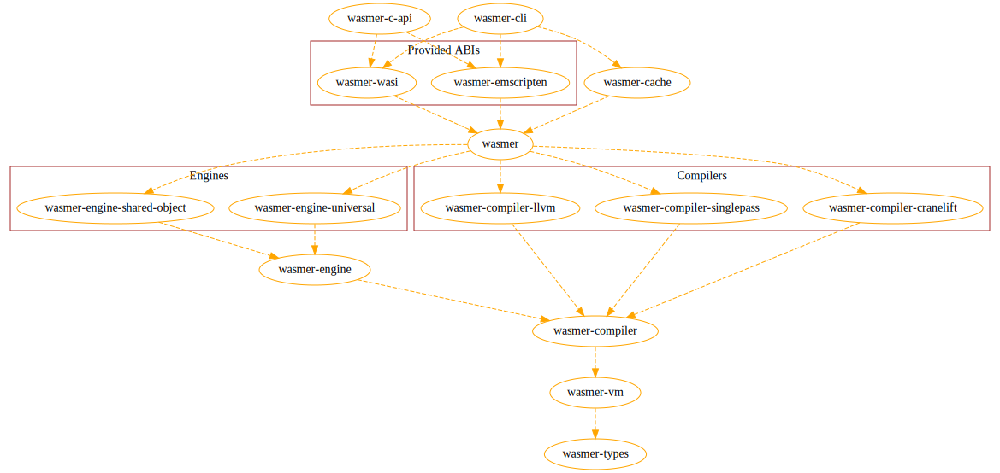

# Migrating from Wasmer 0.x to Wasmer 1.0.0

Wasmer 1.0.0 is getting ready for a full release and is our primary focus. This document will
describe the differences between Wasmer 0.x and Wasmer 1.0.0 and provide examples
to make migrating to the new API as simple as possible.

## Table of Contents

- [Rationale for changes in 1.0.0](#rationale-for-changes-in-100)
- [How to use Wasmer 1.0.0](#how-to-use-wasmer-100)
  - [Installing Wasmer CLI](#installing-wamser-cli)
  - [Using Wasmer 1.0.0](#using-wamser-100)
- [Project structure](#project-structure)
- [Differences](#differences)
  - [Instantiating modules](#instantiating-modules)
  - [Passing host functions](#passing-host-functions)
  - [Accessing the environment as a host function](#accessing-the-environment-as-a-host-function)
  - [Error handling](#error-handling)
  - [Caching modules](#caching-modules)

## Rationale for changes in 1.0.0

Wasmer 0.x was great but as the Wasm community and standards evolve we felt the need to make Wasmer also follow these 
changes.

Wasmer 1.x is what we think a necessary rewrite of a big part of the project to make it more future-proof. 

This version introduces many new features and makes using Wasmer more natural. We did a hard work making it as close 
to the standard API as possible while always providing good performances, flexibility and stability. 

The rewrite of the Wasmer Runtime also comes with a rewrite of the languages integrations to achieve the same goals: 
providing a clearer API and improving the feature set.

In this document you will discover the major changes between Wasmer 0.x and Wasmer 1.x by highlighting how to use the 
new Rust API.

## How to use Wasmer 1.0.0

### Installing Wasmer CLI

See [wasmer.io] for installation instructions.

If you already have wasmer installed, run `wasmer self-update`.

Install the latest versions of Wasmer with [wasmer-nightly] or by following the steps described in the 
documentation: [Getting Started][getting-started].

### Using Wasmer 1.0.0

The CLI interface for Wasmer 1.0.0 is mostly the same as it was in Wasmer 0.x.

One difference is that rather than specifying the compiler with `--backend=cranelift`,
in Wasmer 1.0.0 we prefer using the name of the backend as a flag directly,
for example: `--cranelift`.

The top-level crates that users will usually interface with are:

- [wasmer] - Wasmer's core runtime API
- [wasmer-wasi] - Wasmer's WASI implementation
- [wasmer-emscripten] - Wasmer's Emscripten implementation
- TODO:

See the [examples] to find out how to do specific things in Wasmer 1.0.0.

## Project Structure



The figure above shows the core Wasmer crates and their dependencies with transitive dependencies deduplicated.

Wasmer 1.0.0 has two core architectural abstractions: engines and compilers.

An engine is a system that processes Wasm with a compiler and prepares it to be executed.

A compiler is a system that translates Wasm into a format that can be understood
more directly by a real computer: machine code.

For example, in the [examples] you'll see that we are using the JIT engine and the Cranelift compiler. The JIT engine 
will generate machine code at runtime, using Cranelift, and then execute it.  

For most uses, users will primarily use the [wasmer] crate directly, perhaps with one of our
provided ABIs such as [wasmer-wasi]. However, for users that need finer grained control over
the behavior of wasmer, other crates such as [wasmer-compiler] and [wasmer-engine] may be used
to implement custom compilers and engines respectively.

## Differences

### Instantiating modules

With Wasmer 0.x, instantiating a module was a matter of calling `wasmer::compiler::compile` and then calling 
`instantiate` on the compiled module.

While simple, this did not give you full-control over Wasmer's configuration. For example, choosing another compiler
was not straightforward.

With Wasmer 1.x, we changed this part and made the API look more like how Wasmer works internally to give you more 
control:

```diff
- let module = compile(&wasm_bytes[..])?; 
+ let engine = JIT::new(Cranelift::default()).engine();
+ let store = Store::new(&engine);
+ let module = Module::new(&store, wasm_bytes)?;
- let instance = module.instantiate(&imports)?;
+ let instance = Instance::new(&module, &import_object)?;
```

Note that we did not cover how to create the import object here. This is because this part works the same as it used to 
with Wasmer 0.x.

To get more information on how instantiation now works, have a look at the [dedicated example][instance-example]

### Passing host functions

With Wasmer 0.x passing host functions to the guest was primarily done using the `func!` macro or by directly using 
`Func::new` or `DynamicFunc::new`.

In Wasmer 1.0 the equivalent of `Func::new` is `Function::new_native` /
`Function::new_native_with_env` and the equivalent of `DynamicFunc::new` 
is `Function::new` / `Function::new_with_env`.

Given we have a function like:

```rust
fn sum(a: i32, b: i32) -> i32 {
    a + b
}
```

We want to import this function in the guest module, let's have a look at how it differs between Wasmer 0.x and 
Wasmer 1.x:

```diff
let import_object = imports! {
    "env" => {
-         "sum" => func!(sum),
+         "sum" => Function::new_native(&store, sum),
    }
}
```

The above example illustrates how to import what we call "native functions". There were already available in Wasmer 
0.x through the `func!` macro or with `Func::new`.

There is a second flavor for imported functions: dynamic functions. With Wasmer 0.x you would have created such a 
function using `DynamicFunc::new`, here is how it's done with Wasmer 1.x:

```rust
let sum_signature = FunctionType::new(vec![Type::I32, Type::I32], vec![Type::I32]);
let sum = Function::new(&store, &sum_signature, |args| {
    let result = args[0].unwrap_I32() + args[1].unwrap_i32();
    
    Ok(vec![Value::I32(result)])
});
```

Both examples address different needs and have their own pros and cons. We encourage you to have a look at the 
dedicated example: [Exposing host functions][host-functions-example].

Note that having this API for functions now looks more like the other entities APIs: globals, memories, tables. Here is 
a quick example introducing each of them: [Imports & Exports][imports-exports-example]

### Accessing the environment as a host function

With Wasmer 0.x each function had its own `vm::Ctx`. This was your entrypoint to the module internals and allowed
access to the context of the currently running instance.

With Wasmer 1.0.0 this was changed to provide a simpler yet powerful API.

Let's see an example where we want to have access to the module memory. Here is how that changed from 0.x to 1.0.0:

```diff
+ #[derive(WasmerEnv, Clone, Default)]
+ struct MyEnv {
+     #[wasmer(export)]
+     memory: LazyInit<Memory>,
+ }
+ let env = MyEnv::default();
+
- let get_at = |ctx: &mut vm::Ctx, ptr: WasmPtr<u8, Array>, len: u32| {
+ let get_at = |env: &MyEnv, ptr: WasmPtr<u8, Array>, len: u32| {
-     let mem_desc = ctx.memory(0);
-     let mem = mem_desc.deref();
+     let mem = env.memory_ref().unwrap();
  
      println!("Memory: {:?}", mem);
  
      let string = ptr.get_utf8_string(mem, len).unwrap();
      println!("string: {}", string);
  };

  let import_object = imports! {
      "env" => {
-         "get_at" => func!(get_at),
+         "get_at" => Function::new_native_with_env(&store, env.clone(), get_at),
      }
  };

- let instance = instantiate(wasm_bytes, &import_object)?;
+ let instance = Instance::new(&wasm_bytes, &import_object)?;
```

Here we have a module which provides one exported function: `get`. Each time we call this function it will in turn 
call our imported function `get_at`.

The `get_at` function is responsible for reading the guest module-s memory through the `vm::Ctx`.

With Wasmer 1.0.0 (where the `vm::Ctx` does not exist anymore) we can achieve the same result with something more 
natural: we only use imports and exports to read from the memory and write to it.

However in order to provide an easy to use interface, we now have a trait
that can be implemented with a derive macro: `WasmerEnv`. We must make our
env types implement `WasmerEnv` and `Clone`. We mark an internal field
wrapped with `LazyInit` with `#[wasmer(export)]` to indicate that the type
should be found in the Wasm exports with the name of the field
(`"memory"`). The derive macro then generates helper functions such as
`memory_ref` on the type for easy access to these fields.

See the [`WasmerEnv`](https://docs.rs/wasmer/*/wasmer/trait.WasmerEnv.html)
docs for more information.

Take a look at the following examples to get more details:
* [Interacting with memory][memory]
* [Using memory pointers][memory-pointers]

The other thing where `vm::Ctx` was useful was to pass data from and to host functions. This has also been made simpler
with Wasmer 1.x:

```rust
let shared_counter: Arc<RefCell<i32>> = Arc::new(RefCell::new(0));

#[derive(WasmerEnv, Clone)]
struct Env {
    counter: Arc<RefCell<i32>>,
}

fn get_counter(env: &Env) -> i32 {
    *env.counter.borrow()
}

let get_counter_func = Function::new_native_with_env(
    &store, 
    Env { counter: shared_counter.clone() }, 
    get_counter
);
```

A dedicated example describes how to use this feature: [Exposing host functions][host-functions].

### Error handling

Handling errors with Wasmer 0.x was a bit hard, especially, the `wasmer_runtime::error::RuntimeError`. It was rather 
complex: it had many variants that you had to handle when pattern matching results. This has been made way simpler with 
Wasmer 1.0.0:

```diff
// Retrieve the `get` function from module's exports and then call it
let result = get.call(0, 13);

match result {
-     Err(RuntimeError::InvokeError(InvokeError::TrapCode { .. })) => {
-         // ...
-     }
-     Err(RuntimeError::InvokeError(InvokeError::FailedWithNoError)) => {
-         // ...
-     }
-     Err(RuntimeError::InvokeError(InvokeError::UnknownTrap { .. })) => {
-         // ...
-     }
-     Err(RuntimeError::InvokeError(InvokeError::UnknownTrapCode { .. })) => {
-         // ...
-     }
-     Err(RuntimeError::InvokeError(InvokeError::EarlyTrap(_))) => {
-         // ...
-     }
-     Err(RuntimeError::InvokeError(InvokeError::Breakpoint(_))) => {
-         // ...
-     }
-     Err(RuntimeError::Metering(_)) => {
-         // ...
-     }
-     Err(RuntimeError::InstanceImage(_)) => {
-         // ...
-     }
-     Err(RuntimeError::User(_)) => {
-         // ...
-     }
+     Error(e) => {
+         println!("Error caught from `div_by_zero`: {}", e.message());
+          
+         let frames = e.trace();
+         let frames_len = frames.len();
+         
+         // ...
+     }
    Ok(_) => {
        // ...
    },
}
``` 

As you can see here, handling errors is really easy now! You may find the following examples useful to get more familiar
with this topic:
* [Handling Errors][errors]
* [Interrupting Execution][exit-early]

Note that with Wasmer 1.0.0, each function that is part of the API has its own kind of error. For example:
* Instantiating a module may return `InstantiationError`s;
* Getting exports from the guest module may return `ExportError`s;
* Calling an exported function may return `RuntimeError`s;
* ...

### Caching modules

You may be aware Wasmer, since 0.x, allows you to cache compiled module so that further executions of your program
will be faster.

Because caching may bring a significant boost when running Wasm modules we wanted to make it easier to use with 
Wasmer 1.0.0.

With Wasmer 0.x you had to handle the whole caching process inside your program's code. With Wasmer 1.0.0
you'll be able to delegate most of the work to Wasmer:

```diff
- let artifact = module.cache().unwrap();
- let bytes = artifact.serialize().unwrap();
- 
- let path = "module_cached.so";
- fs::write(path, bytes).unwrap();
+ module.serialize_to_file(path)?;

- let mut file = File::open(path).unwrap();
- let cached_bytes = &mut vec![];
- file.read_to_end(cached_bytes);
- drop(file);
- 
- let cached_artifact = Artifact::deserialize(&cached_bytes).unwrap();
- let cached_module = unsafe { load_cache_with(cached_artifact, &default_compiler()) }.unwrap();
+ let cached_module = unsafe { Module::deserialize_from_file(&store, path) }?;
``` 

[examples]: https://docs.wasmer.io/integrations/examples
[wasmer]: https://crates.io/crates/wasmer
[wasmer-wasi]: https://crates.io/crates/wasmer-wasi
[wasmer-emscripten]: https://crates.io/crates/wasmer-emscripten
[wasmer-engine]: https://crates.io/crates/wasmer-engine
[wasmer-compiler]: https://crates.io/crates/wasmer-compiler
[wasmer.io]: https://wasmer.io
[wasmer-nightly]: https://github.com/wasmerio/wasmer-nightly/
[getting-started]: https://docs.wasmer.io/ecosystem/wasmer/getting-started
[instance-example]: https://docs.wasmer.io/integrations/examples/instance
[imports-exports-example]: https://docs.wasmer.io/integrations/examples/imports-and-exports
[host-functions-example]: https://docs.wasmer.io/integrations/examples/host-functions
[memory]: https://docs.wasmer.io/integrations/examples/memory
[memory-pointers]: https://docs.wasmer.io/integrations/examples/memory-pointers
[host-functions]: https://docs.wasmer.io/integrations/examples/host-functions
[errors]: https://docs.wasmer.io/integrations/examples/errors
[exit-early]: https://docs.wasmer.io/integrations/examples/exit-early
