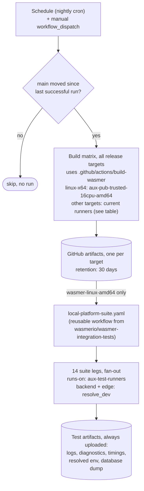

# Nightly CI

Nightly CI builds the Wasmer CLI for every release target from `main`
each night, runs the platform integration test suite against the Linux
x86-64 binary, and keeps the binaries and the full test evidence as
retrievable artifacts. The Linux x86-64 build and all test legs run on
Wasmer's self-hosted AWS runners; the remaining targets keep their
current runners.

**Status: specification.** Nothing described here is merged yet. The
`nightly.yaml` workflow, the `build-wasmer` composite action, and the
suite's `wasmer_version` input are all work items of this plan — see
[Implementation sequencing](#implementation-sequencing). Sections below
describe the intended end state unless marked otherwise.

Tracking: [SRE-1711](https://linear.app/wasmer/issue/SRE-1711/upgrade-wasmer-runtime-pipelines)
(subtickets [WARP-73](https://linear.app/wasmer/issue/WARP-73/set-up-nightly-wasmer-prereleases),
[SRE-1696](https://linear.app/wasmer/issue/SRE-1696/update-wasmer-runtime-pipelines-to-use-aws-arc-runners),
[SRE-1320](https://linear.app/wasmer/issue/SRE-1320/re-enable-integration-tests-for-wasmer-repo)).

## Problems this solves

1. **Consumers need fresh builds without a release.** Downstream CI
   (EdgeJS among others) sometimes needs a Wasmer build containing an
   unreleased change to go green. A full release carries version bumps
   and changelog work, so "this PR needs a fresh Wasmer" and "we should
   cut a release" were coupled. This plan builds the production half of
   that channel: a nightly, validated, retrievable build. It does *not*
   yet give consumers a stable pointer to fetch — a consumer must
   resolve the latest successful `nightly.yaml` run itself, and needs a
   cross-repo token to do it. WARP-73's open question of where the
   artifacts finally live (S3, prerelease, or GitHub artifacts) stays
   open; see [Consumption](#consumption) and [Deferred work](#deferred-work).
2. **Merge builds were unvalidated and short-lived.** `build.yml`
   already builds the CLI on every merge to `main`, but the artifacts
   expire after 2 days and are never exercised against the platform. A
   runtime regression on `main` surfaces only at release time, or as
   noise in environment-dependent nightly tests against dev/prod.
3. **Runtime regressions were hard to isolate.** Existing nightly
   integration tests run against live environments, so a red night can
   mean a platform issue, an environment issue, or a runtime issue. The
   nightly runs the platform locally on the runner, which removes the
   live-environment variable. It does not remove the platform variable:
   backend and Edge track their latest dev releases by default, so a
   regression in either can still redden a night. See
   [What the nightly holds fixed](#what-the-nightly-holds-fixed).
4. **The AWS runner fleet needed a trusted workload.** The ARC runner
   fleet on the aux EKS cluster (SRE-1472) is provisioned but has never
   run a public-repository job. The nightly is its first such workload
   and supplies load for the cost/performance evaluation (SRE-1699) —
   on nights where `main` moved, which the skip gate makes irregular
   rather than daily.
5. **Integration tests for this repo have been off since early 2026**
   (SRE-1320), disabled for flakiness. The nightly brings them back on
   a schedule that cannot block merges, which is only safe with the
   triage contract in [Failure handling](#failure-handling-and-ownership).

## System overview

Each suite leg starts the local platform (backend, Edge, databases) in
containers on the runner, installs the artifact binary as the `wasmer`
CLI, and runs one integration test suite against that stack.

### Runner choice

The build job and the suite legs target **different** scale sets, for a
capacity reason that is easy to get wrong:

| Job                       | Scale set                     | Why                                                                                                                                                                                                                    |
| ------------------------- | ----------------------------- | ---------------------------------------------------------------------------------------------------------------------------------------------------------------------------------------------------------------------- |
| linux-x64 build           | `aux-pub-trusted-16cpu-amd64` | One 16-vCPU node, `maxRunners: 1`, holds the public write identity. Correct for a single long build job.                                                                                                                |
| 14 suite legs             | `aux-test-runners`            | `maxRunners: 16`, pod requests sized for the local-platform stack inside dind. This is the set the suite was tuned on; it is the only one that can run the legs concurrently.                                           |

Sending the legs to `aux-pub-trusted-16cpu-amd64` would serialize all
14 behind a single runner and hold the trusted identity for hours — do
not do it, even though "trusted workload on the trusted set" reads
right.

## Build targets

The nightly builds what a release publishes, on the same runner types
the release uses per target. Only `linux-x64` moves to the AWS fleet in
this plan; the fleet has no arm64 or macOS capacity, and the two
cross-compiled targets are deferred with the rest of `build.yml`
(SRE-1696).

| Target        | Artifact                 | Runner (nightly)              | Integration-tested |
| ------------- | ------------------------ | ----------------------------- | ------------------ |
| linux-x64     | `wasmer-linux-amd64`     | `aux-pub-trusted-16cpu-amd64` | yes                |
| linux-arm64   | `wasmer-linux-aarch64`   | `ubuntu-22.04-arm`            | no (deferred)      |
| macos-arm     | `wasmer-darwin-arm64`    | `depot-macos-14`              | no                 |
| windows-x64   | `wasmer-windows-amd64`   | `windows-2022`                | no                 |
| windows-gnu64 | `wasmer-windows-gnu64`   | `ubuntu-latest` (cross)       | no                 |
| linux-riscv64 | `wasmer-linux-riscv64`   | `ubuntu-latest` (cross, dind) | no                 |
| full source   | `wasmer-full-source`     | `ubuntu-latest`               | n/a                |

There is no x86-64 macOS target. The integration suite runs against
`linux-x64` — the architecture the suite runners execute; every other
target is build-validated and kept as an artifact.

## What the nightly holds fixed

The CLI is the change under test. Everything else is held as steady as
the current suite allows, which is not the same as pinned:

- **Fixed by construction**: the platform runs locally on the runner
  from the suite's compose stack, so no shared dev/prod environment can
  redden a night.
- **Floating**: `backend_version: resolve_dev` and
  `edge_version: resolve_dev` resolve the *latest* backend and Edge dev
  release at run time. A backend or Edge regression can therefore
  redden a nightly that contains no runtime change. Every leg uploads
  its resolved environment, so triage can always tell which versions
  ran — but the first triage question stays "did backend or Edge move?"
- **Also floating**: the test suite itself tracks
  `wasmer-integration-tests@main`.

Pinning backend and Edge to a known-good release, and bumping that pin
deliberately, would make a red night implicate the runtime directly.
That is an open decision, not a default — see
[Open decisions](#open-decisions).

## Components

| Component                       | Location                                        | Status  | Role                                                                                                                                                                                             |
| ------------------------------- | ----------------------------------------------- | ------- | ------------------------------------------------------------------------------------------------------------------------------------------------------------------------------------------------- |
| `build-wasmer` composite action | `.github/actions/build-wasmer/` (this repo)     | to build | Single source of the per-target build recipe: toolchain, LLVM, feature flags, packaging. Extracted from the ~250 inline lines of the `build.yml` matrix, then called by both `build.yml` and the nightly. |
| `nightly.yaml`                  | `.github/workflows/` (this repo)                | to build | Cron + `workflow_dispatch` trigger, skip-if-unchanged check, build job, suite invocation, artifact retention.                                                                                    |
| `wasmer_version` suite input    | `wasmerio/wasmer-integration-tests`             | to build | New input on `local-platform-suite.yaml` / `local-platform-test.yaml`: accepts `artifact:wasmerio/wasmer:<run_id>:wasmer-linux-amd64` in the grammar already used for `backend_version`, unpacks `dist/wasmer.tar.gz`, and installs it in place of the `wasmerio/setup-wasmer@v2` step. |
| `local-platform-suite.yaml`     | `wasmerio/wasmer-integration-tests`             | exists  | Reusable workflow; fans out the 14 legs from `.github/integration-test-suites.json`. Called today by backend `qa.yaml` with an artifact-built image.                                              |
| ARC runner fleet                | `wasmerio/infrastructure` (`aws/clusters/aux/`) | exists  | Self-hosted ephemeral runners on the aux EKS cluster. See [Runner choice](#runner-choice) and [Prerequisites](#prerequisites).                                                                    |

## Scope of validation

The suite exercises the CLI and client surface against the platform:
deploy, run, package publish, app lifecycle. Edge embeds the runtime as
a Rust crate, so runtime-inside-Edge behavior is covered separately by
the Edge repository's nightly e2e build against Wasmer `main`.

## Prerequisites

These are infrastructure changes the nightly depends on. None of them
belong to this repository, and the workflow cannot go green before they
land.

- **Runner-group membership.** A reusable workflow runs in the
  *caller's* repository context, so the suite legs are
  `wasmerio/wasmer` jobs. `wasmerio/wasmer` must be added to the
  `aux-test-runners` runner group, which is org-level GitHub
  configuration, not Terraform. It already allows public repositories
  and already carries the runner registrations; the `aux-public` group
  (holding `aux-pub-trusted-16cpu-amd64`) already lists this repository.
- **Runner image gaps.** The `rust-runner` image runs as a non-root
  `runner` user with no `sudo`, and ships no `ninja`. The current build
  steps install `ninja` via `sudo apt` and hardcode
  `LLVM_CONFIG_PATH=/usr/bin/llvm-config-22`, while the image keeps its
  pinned LLVM under `/opt/llvm-22`. The `build-wasmer` action must stop
  assuming root-plus-apt and take the toolchain locations as inputs, or
  the image must supply them. Whichever way it is resolved, keep both
  the GitHub-hosted and the ARC path working — `build.yml` still runs
  on GitHub-hosted runners for the other targets.
- **Secrets.** The suite's PAT (`actions:read` on the artifact source
  repo, `contents:read` for private Edge dev releases) must be
  available to this repository. It is only ever exposed to
  `schedule`/`workflow_dispatch` runs from `main`.

## Failure handling and ownership

A scheduled suite with 14 legs and no owner degrades into ignored red —
that is what disabled this repository's integration tests in the first
place (SRE-1320), and why the environment nightlies in
`wasmer-integration-tests` have their Slack webhooks commented out. The
nightly ships with a triage contract or it does not ship:

- **Notification**: one Slack message per failing night to the owning
  channel, listing the failing legs and linking the run — not one per
  leg.
- **Owner**: a named rotation triages the previous night before the
  next one starts. Triage means classifying, not necessarily fixing.
- **Known issues**: failures already tracked go in the suite's
  `known-issues.jsonc` with a Linear ticket, following the existing
  integration-test-failure workflow, so a known-red leg does not mask a
  new one.
- **Quiet-down rule**: a leg that is red for known reasons for five
  consecutive nights is either fixed, ticketed with an owner, or
  removed from the nightly. No permanent red.
- **Non-blocking**: the nightly never gates merges to `main`.

## Artifacts

- **Binaries**: one GitHub artifact per release target,
  30-day retention. `wasmer -vV` reports the commit hash and build
  date, so the artifacts carry no separate version stamp — but verify
  this on the first ARC build: the runner image sets
  `RUSTC_WRAPPER=sccache` globally, and `git_version!` reads `.git` at
  compile time while sccache keys on source text, so a cache hit can
  embed a stale hash. If it does, opt the CLI crate out of sccache or
  add an explicit stamp.
- **Test evidence**: every leg uploads its logs, diagnostics, timings,
  resolved environment, and local database dump on success and on
  failure. This makes any nightly — green or red — reconstructible for
  debugging and bisection within the retention window.

### Consumption

Retrieve a binary with `gh run download <run_id> -n <artifact>` from
the latest successful `nightly.yaml` run. For automated consumers this
is deliberately unfinished: there is no `latest` pointer, so a consumer
must first resolve the most recent successful run through the Actions
API and hold a token with `actions:read` on this repository. Closing
that gap is the S3 channel in [Deferred work](#deferred-work).

## Security model

Every nightly job that targets the AWS fleet runs in a trusted context:
`schedule` and `workflow_dispatch` runs from `main`, executed by
maintainer-reviewed workflow files. Pull-request-triggered jobs never
target `aux-*` runner labels. The `pub-trusted` and `pub-pr` node pools
are separate, so the trusted scale set shares no nodes with any PR
workload. macOS, Windows, and cross-compiled build legs run on Depot
and GitHub-hosted runners, outside the fleet. Repository secrets are
unavailable to fork-triggered runs.

One trust-boundary decision is explicit and needs sign-off: adding this
public repository to the `aux-test-runners` group puts
`wasmerio/wasmer`-context jobs on a **privileged-dind** scale set that
today serves private repositories. The mitigation is the routing rule
above — only `main`-triggered scheduled and dispatched runs carry the
`aux-test-runners` label; PR and fork runs must never reach it.

## Implementation sequencing

Four independently reviewable changes, in order. Each has its own
failure mode, and the first two are the ones most likely to surprise.

1. **Extract `build-wasmer`** in this repo, with `build.yml` still on
   its current runners. Proves the refactor in isolation: the release
   pipeline must stay byte-for-byte equivalent.
2. **Add `wasmer_version`** to `wasmer-integration-tests`, exercised
   once by `workflow_dispatch` against a hand-picked `build.yml` run.
   Proves the artifact selector, the unpack, and the CLI install.
3. **Infrastructure**: runner-group membership and the runner-image
   toolchain fixes. Proven by a throwaway workflow that runs
   `build-wasmer` for `linux-x64` on `aux-pub-trusted-16cpu-amd64`.
4. **`nightly.yaml`**, wiring the three together, plus the
   notification and triage setup.

## Open decisions

- **Pin or float backend/Edge.** Floating (`resolve_dev`) keeps the
  nightly honest about the platform Wasmer actually meets; pinning
  makes a red night implicate the runtime. A middle option is to float
  and record, then pin only when triage noise proves the case.
- **Where nightly binaries finally live** — GitHub artifacts, S3, or
  GitHub prereleases (WARP-73's open question). This plan assumes
  artifacts and defers the rest; the answer changes what consumers
  integrate against, so it should be settled before EdgeJS wires
  anything up.
- **Cadence.** Nightly-if-changed is assumed here. Per-merge
  prereleases and buffered daily publication are the alternatives
  WARP-73 raised.

## Deferred work

- **Public release channel**: publishing nightlies to S3 with dated
  prefixes, a `latest` pointer, and lifecycle expiry, for consumption
  outside GitHub Actions. This is what turns problem 1 into a solved
  problem for automated consumers.
- **Integration-test legs on additional architectures**, starting with
  `linux-arm64` — blocked on arm64 capacity in the fleet.
- **Remaining build targets on ARC**: arm64, and the cross-compiled
  `windows-gnu64` / `linux-riscv64` legs (SRE-1696).
- **PR-leg migration to ARC runners**: moves `pull_request` jobs to the
  public-PR scale set after its penetration-testing phase (SRE-1696).
