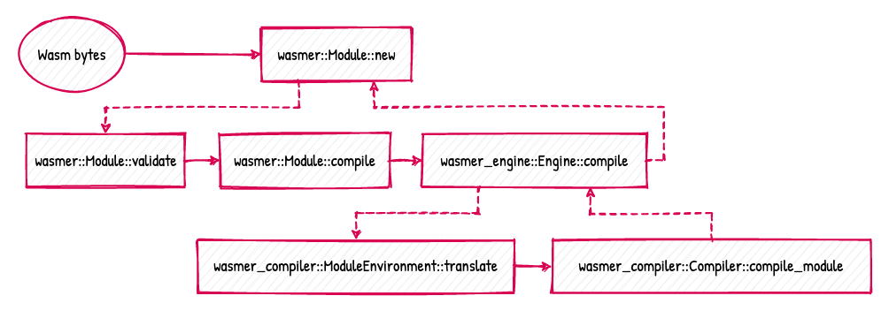
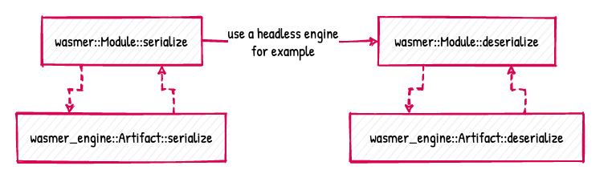
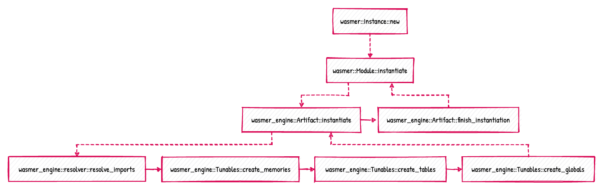

# Wasmer Examples

This directory contains a collection of examples. This isn't an
exhaustive collection though, if one example is missing, please ask,
we will be happy to fulfill your needs!

## Handy Diagrams

As a quick introduction to Wasmer's main workflows, here are three
diagrams. We hope it provides an overview of how the crates assemble
together.

1. **Module compilation**, illustrates how WebAssembly bytes are
   validated, parsed, and compiled, with the help of the
   `wasmer::Module`, `wasmer_engine::Engine`, and
   `wasmer_compiler::Compiler` API.

   

2. **Module serialization**, illustrates how a module can be
   serialized and deserialized, with the help of
   `wasmer::Module::serialize` and `wasmer::Module::deserialize`. The
   important part is that the engine can changed between those two
   steps, and thus how a headless engine can be used for the
   deserialization.

   

3. **Module instantiation**, illustrates what happens when
   `wasmer::Instance::new` is called.

   

## Examples

The examples are written in a difficulty/discovery order. Concepts that
are explained in an example is not necessarily re-explained in a next
example.

### Basics

1. [**Hello World**][hello-world], explains the core concepts of the Wasmer
   API for compiling and executing WebAssembly.

   _Keywords_: introduction, instance, module.

   <details>
    <summary><em>Execute the example</em></summary>

    ```shell
    $ cargo run --example hello-world --release --features "cranelift"
    ```

   </details>

2. [**Instantiating a module**][instance], explains the basics of using Wasmer
   and how to create an instance out of a Wasm module.
   
   _Keywords_: instance, module.
   
   <details>
    <summary><em>Execute the example</em></summary>

    ```shell
    $ cargo run --example instance --release --features "cranelift"
    ```

   </details>

3. [**Handling errors**][errors], explains the basics of interacting with
   Wasm module memory.
   
   _Keywords_: instance, error.
   
   <details>
    <summary><em>Execute the example</em></summary>

    ```shell
    $ cargo run --example errors --release --features "cranelift"
    ```

   </details>

4. [**Interacting with memory**][memory], explains the basics of interacting with
   Wasm module memory.
   
   _Keywords_: memory, module.
   
   <details>
    <summary><em>Execute the example</em></summary>

    ```shell
    $ cargo run --example memory --release --features "cranelift"
    ```

   </details>

### Exports

1. [**Exported global**][exported-global], explains how to work with
   exported globals: get/set their value, have information about their 
   type.
   
   _Keywords_: export, global.

   <details>
   <summary><em>Execute the example</em></summary>

   ```shell
   $ cargo run --example exported-global --release --features "cranelift"
   ```

   </details>
   
2. [**Exported function**][exported-function], explains how to get and
   how to call an exported function. They come in 2 flavors: dynamic,
   and “static”/native. The pros and cons are discussed briefly.
   
   _Keywords_: export, function, dynamic, static, native.

   <details>
   <summary><em>Execute the example</em></summary>

   ```shell
   $ cargo run --example exported-function --release --features "cranelift"
   ```

   </details>


3. [**Exported memory**][exported-memory], explains how to read from 
    and write to exported memory.
   
   _Keywords_: export, memory.

   <details>
   <summary><em>Execute the example</em></summary>

   ```shell
   $ cargo run --example exported-memory --release --features "cranelift"
   ```

   </details>

### Imports

1. [**Imported global**][imported-global], explains how to work with
   imported globals: create globals, import them, get/set their value.
   
   _Keywords_: import, global.

   <details>
   <summary><em>Execute the example</em></summary>

   ```shell
   $ cargo run --example imported-global --release --features "cranelift"
   ```

   </details>

2. [**Imported function**][imported-function], explains how to define 
   an imported function. They come in 2 flavors: dynamic,
   and “static”/native.
   
   _Keywords_: import, function, dynamic, static, native.

   <details>
   <summary><em>Execute the example</em></summary>

   ```shell
   $ cargo run --example imported-function --release --features "cranelift"
   ```

   </details>

### Externs

1. [**Table**][table], explains how to use Wasm Tables from the Wasmer API.

   _Keywords_: basic, table, call_indirect

   <details>
   <summary><em>Execute the example</em></summary>

   ```shell
   $ cargo run --example table --release --features "cranelift"
   ```

   </details>
   
2. [**Memory**][memory], explains how to use Wasm Memories from
   the Wasmer API.  Memory example is a work in progress.

   _Keywords_: basic, memory

   <details>
   <summary><em>Execute the example</em></summary>

   ```shell
   $ cargo run --example memory --release --features "cranelift"
   ```

   </details>

### Tunables

1. [**Limit memory**][tunables-limit-memory], explains how to use Tunables to limit the
   size of an exported Wasm memory

   _Keywords_: basic, tunables, memory

   <details>
   <summary><em>Execute the example</em></summary>

   ```shell
   $ cargo run --example tunables-limit-memory --release --features "cranelift"
   ```

   </details>

### Engines

1. [**Engine**][engine], explains what an engine is and how to set it up. The
   example completes itself with the compilation of the Wasm module, its
   instantiation, and finally, by calling an exported function.
   
   _Keywords_: engine, in-memory, executable code.
   
   <details>
   <summary><em>Execute the example</em></summary>

   ```shell
   $ cargo run --example engine --release --features "cranelift"
   ```

   </details>

2. [**Headless engines**][engine-headless], explains what a headless
   engine is, what problem it does solve, and what are the benefits of
   it. The example completes itself with the instantiation of a
   pre-compiled Wasm module, and finally, by calling an exported
   function.
   
   _Keywords_: native, engine, constrained environment, ahead-of-time
   compilation, cross-compilation, executable code, serialization.

   <details>
   <summary><em>Execute the example</em></summary>

   ```shell
   $ cargo run --example engine-headless --release --features "cranelift"
   ```

   </details>

4. [**Cross-compilation**][cross-compilation], illustrates the power
   of the abstraction over the engines and the compilers, such as it
   is possible to cross-compile a Wasm module for a custom target.
   
   _Keywords_: engine, compiler, cross-compilation.

   <details>
   <summary><em>Execute the example</em></summary>

   ```shell
   $ cargo run --example cross-compilation --release --features "cranelift"
   ```

   </details>
   
5. [**Features**][features], illustrates how to enable WebAssembly
   features that aren't yet stable.
   
   _Keywords_: engine, features.
   
   <details>
   <summary><em>Execute the example</em></summary>
   
   ```shell
   $ cargo run --example features --release --features "cranelift"
   ```
   
   </details>

### Compilers

1. [**Singlepass compiler**][compiler-singlepass], explains how to use
   the [`wasmer-compiler-singlepass`] compiler.
   
   _Keywords_: compiler, singlepass.

   <details>
   <summary><em>Execute the example</em></summary>

   ```shell
   $ cargo run --example compiler-singlepass --release --features "singlepass"
   ```

   </details>

2. [**Cranelift compiler**][compiler-cranelift], explains how to use
   the [`wasmer-compiler-cranelift`] compiler.
   
   _Keywords_: compiler, cranelift.

   <details>
   <summary><em>Execute the example</em></summary>

   ```shell
   $ cargo run --example compiler-cranelift --release --features "cranelift"
   ```

   </details>

3. [**LLVM compiler**][compiler-llvm], explains how to use the
   [`wasmer-compiler-llvm`] compiler.
   
   _Keywords_: compiler, llvm.

   <details>
   <summary><em>Execute the example</em></summary>

   ```shell
   $ cargo run --example compiler-llvm --release --features "llvm"
   ```

   </details>

### Integrations

1. [**WASI**][wasi], explains how to use the [WebAssembly System
   Interface][WASI] (WASI), i.e. the [`wasmer-wasi`] crate.
   
   _Keywords_: wasi, system, interface

   <details>
   <summary><em>Execute the example</em></summary>

   ```shell
   $ cargo run --example wasi --release --features "cranelift,wasi"
   ```

   </details>

2. [**WASI Pipes**][wasi-pipes], builds on the WASI example to show off
   stdio piping in Wasmer.

   _Keywords_: wasi, system, interface

   <details>
   <summary><em>Execute the example</em></summary>

   ```shell
   $ cargo run --example wasi-pipes --release --features "cranelift,wasi"
   ```

   </details>

[hello-world]: ./hello_world.rs
[engine]: ./engine.rs
[engine-headless]: ./engine_headless.rs
[compiler-singlepass]: ./compiler_singlepass.rs
[compiler-cranelift]: ./compiler_cranelift.rs
[compiler-llvm]: ./compiler_llvm.rs
[cross-compilation]: ./engine_cross_compilation.rs
[exported-global]: ./exports_global.rs
[exported-function]: ./exports_function.rs
[exported-memory]: ./exports_memory.rs
[imported-global]: ./imports_global.rs
[imported-function]: ./imports_function.rs
[imported-function-env]: ./imports_function_env.rs
[imported-function-env-global]: ./imports_function_env_global.rs
[instance]: ./instance.rs
[wasi]: ./wasi.rs
[wasi-pipes]: ./wasi_pipes.rs
[table]: ./table.rs
[memory]: ./memory.rs
[errors]: ./errors.rs
[tunables-limit-memory]: ./tunables_limit_memory.rs
[features]: ./features.rs
[`wasmer-compiler-singlepass`]: https://github.com/wasmerio/wasmer/tree/master/lib/compiler-singlepass
[`wasmer-compiler-cranelift`]: https://github.com/wasmerio/wasmer/tree/master/lib/compiler-cranelift
[`wasmer-compiler-llvm`]: https://github.com/wasmerio/wasmer/tree/master/lib/compiler-llvm
[`wasmer-wasi`]: https://github.com/wasmerio/wasmer/tree/master/lib/wasi
[WASI]: https://github.com/WebAssembly/WASI
